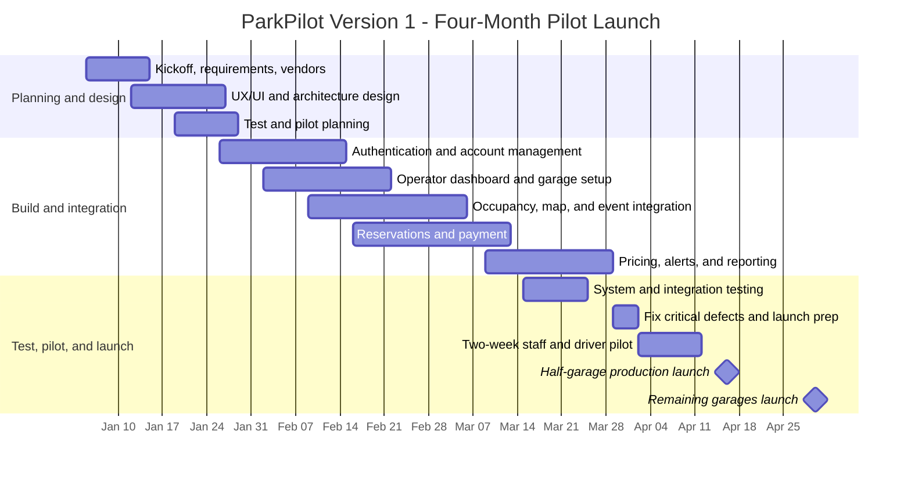

# ParkPilot — Software Requirements Specification

**Version:** 0.2 — Requirements, work breakdown structure, and draft timeline  
**Project owner:** WE ARE $oftware ¢orp.  
**Pilot customer:** Bayou City Parking  
**Status:** Working semester project document

## 1. Vision and Scope

### 1.1 Project acquisition

WE ARE $oftware ¢orp. is a small Houston software startup creating its first product. The company identified a business opportunity in downtown event parking: drivers waste time circling for spaces, while garage operators can miss revenue when drivers cannot easily see availability, compare options, or reserve before arriving. The startup will earn a monthly software fee from garage operators plus a small fee for each completed reservation.

Bayou City Parking will be the pilot customer. Its initial rollout covers several garages in one downtown stadium district.

### 1.2 Product vision

ParkPilot is a web and mobile parking platform that helps drivers select the right garage before an event. It combines near-real-time vacancy, price, parking type, event proximity, walking distance, and integrated mapping in one experience. Drivers can prepay to guarantee entry to a selected garage. Operators can manage garages, capacity, reservations, prices, event data, and operational reporting.

**Vision statement:** For drivers attending downtown events who want a reliable, convenient place to park, ParkPilot is a parking platform that shows near-real-time garage availability, event proximity, and transparent reservation pricing. Unlike a basic directory or parking-payment app, it is designed around event demand, walking distance, and operator-supplied occupancy data.

### 1.3 Business objectives

1. Reduce the time drivers spend searching for event parking.
2. Increase Bayou City Parking occupancy and reservation revenue.
3. Prove that a small startup can generate recurring operator revenue and reservation-fee income.
4. Establish a scalable product that can later serve additional garage operators and downtown districts.

### 1.4 In scope for Version 1

- Mobile-responsive website and native iOS/Android applications.
- Driver accounts using email/password, Google sign-in, or Apple sign-in.
- Stadium-district event discovery and event-calendar integration, with manual operator event entry/correction.
- Integrated interactive map showing garages, vacancy level/percent full, price, walking distance, and walking time to the selected event.
- Occupancy integration with existing garage gate or occupancy systems, refreshed at least once per minute.
- Standard and EV-charging parking reservations; accessible spaces are displayed but cannot be reserved online.
- Prepaid reservations using credit/debit cards, Apple Pay, and Google Pay.
- Reservation confirmation, receipt, history, cancellation, and paid time-extension request.
- A 15-minute grace period after scheduled arrival. After that period, the driver must request and pay for additional time.
- Full refund when a driver cancels at least one hour before scheduled arrival.
- Text, push, and email alerts for reservation activity and garage-full conditions.
- Operator dashboard for occupancy, pricing, reservation management, event data, revenue, and performance reporting.
- Demand-based pricing that rises or falls no more than 25% from a garage's normal rate; the final price is shown before checkout.

### 1.5 Out of scope for Version 1

- Reservation of accessible parking spaces online or verification of disability-placard eligibility.
- Assignment of an individual numbered parking space.
- Automated gate hardware installation or replacement.
- Fully autonomous pricing without an operator-defined normal rate and a hard ±25% guardrail.
- Valet operations, enforcement/towing workflows, and on-street public parking.
- Cash payments through ParkPilot.

## 2. Existing Software Landscape

SpotHero and ParkWhiz demonstrate that advance booking for stadium and event parking is an established market. SpotHero describes an event flow where a driver finds an event, reviews parking on a map, pays, and receives a prepaid reservation; ParkWhiz also offers parking reservations around stadiums and event venues. [SpotHero event parking](https://spothero.com/destination/san-francisco/oracle-park-parking) and [ParkWhiz](https://www.parkwhiz.com/) both confirm that reservation and event parking are baseline expectations.

ParkPilot will compete by focusing its pilot on a single operator's connected garages in a downtown stadium district. Its differentiators are:

| Area | ParkPilot approach |
| --- | --- |
| Availability | Receives operator gate/occupancy data at least once per minute and shows vacancy or percent full. |
| Event decision | Ranks garages around a selected event using walking distance, walking time, price, parking type, and availability. |
| Pricing fairness | Allows demand-based pricing in both directions but limits it to ±25% of a published normal rate. |
| Operator control | Gives Bayou City Parking a dashboard for capacity, events, pricing, reservations, and full operational reporting. |
| Local rollout | Starts with one operator's several garages, which simplifies data integration and operating standards before scaling. |

## 3. Stakeholders and Users

| Stakeholder | Interest / responsibility |
| --- | --- |
| WE ARE $oftware ¢orp. | Product owner; builds, operates, and supports ParkPilot. |
| Bayou City Parking | Pilot customer; supplies garage data, manages rates/events/reservations, and evaluates business results. |
| Event drivers | Search, compare, reserve, pay for, use, extend, or cancel parking. |
| Garage operations staff | Monitor occupancy, resolve reservation issues, and maintain operational data. |
| Finance/management | Reviews revenue, occupancy, fees, refunds, and performance reports. |
| Payment and map providers | Provide third-party payment and mapping functions. |

## 4. System Environment, Assumptions, and Constraints

### 4.1 System environment

ParkPilot will be delivered through a public website and mobile apps. It will use third-party mapping/navigation, payment processing, identity-provider, event-calendar, and garage-occupancy integrations.

### 4.2 Assumptions

- Bayou City Parking provides reliable API or feed access from its existing gate/occupancy systems.
- Each pilot garage has a normal published parking rate from which the permitted ±25% demand adjustment is calculated.
- Event calendars can be imported from a source and corrected manually by authorized operators.
- Drivers have a supported mobile device and internet connection when making or modifying a reservation.

### 4.3 Constraints

- Occupancy information must refresh at least once per minute.
- ParkPilot does not store raw payment-card data; a payment provider processes payment details.
- The system must display final price before a driver confirms payment.
- The platform must not reserve accessible spaces online.

## 5. Functional Requirements

| ID | Requirement |
| --- | --- |
| FR-01 | The system shall allow a driver to register using email/password, Google, or Apple sign-in. |
| FR-02 | The system shall allow a driver to sign in, sign out, and reset a password for an email-based account. |
| FR-03 | The system shall display upcoming stadium-district events from an integrated event-calendar source. |
| FR-04 | The system shall allow authorized operators to add, correct, or remove event information. |
| FR-05 | The system shall display participating garages on an integrated interactive map. |
| FR-06 | The system shall display each garage's vacancy count or percent full, with the time of the latest update. |
| FR-07 | The system shall calculate and display walking distance and walking time from a garage to a selected event venue. |
| FR-08 | The system shall allow drivers to filter and compare garages by vacancy, price, walking distance, parking type, and event proximity. |
| FR-09 | The system shall allow a driver to reserve standard parking or an EV-charging parking option when available. |
| FR-10 | The system shall display accessible spaces but shall not allow them to be reserved online. |
| FR-11 | The system shall calculate a demand-adjusted price within ±25% of the operator-defined normal rate and show the final price before checkout. |
| FR-12 | The system shall accept credit/debit cards, Apple Pay, and Google Pay for reservation payment. |
| FR-13 | The system shall issue a reservation confirmation and digital receipt after successful payment. |
| FR-14 | The system shall hold a paid reservation for 15 minutes after the scheduled arrival time and then require a paid extension request. |
| FR-15 | The system shall allow a driver to cancel a reservation and issue a full refund when cancellation occurs at least one hour before scheduled arrival. |
| FR-16 | The system shall send reservation, cancellation, and garage-full alerts by text message, push notification, and email. |
| FR-17 | The system shall allow authorized operators to manage garage capacity, normal rates, demand-pricing rules, reservations, and parking-type availability. |
| FR-18 | The system shall provide operator reports for occupancy, reservations, revenue, refunds, and garage performance. |

## 6. Non-Functional Requirements

| ID | Requirement |
| --- | --- |
| NFR-01 | The system shall refresh occupancy data for connected garages at least once per minute under normal operating conditions. |
| NFR-02 | The system shall show the timestamp of the most recent occupancy update. |
| NFR-03 | The system shall provide a responsive interface for current desktop and mobile browser versions and native iOS/Android apps. |
| NFR-04 | The system shall use encrypted connections for all user, payment, and operator sessions. |
| NFR-05 | The system shall delegate payment-card processing to a compliant payment provider and shall not store raw payment-card details. |
| NFR-06 | The system shall restrict operator dashboard functions to authorized operator accounts. |
| NFR-07 | The system shall retain an auditable record of reservation, cancellation, refund, and operator-pricing actions. |
| NFR-08 | The system shall show a clear error or stale-data indicator when a garage data feed is unavailable. |

## 7. Initial Use-Case Inventory

| ID | Use case | Primary actor |
| --- | --- | --- |
| UC-01 | Register account | Driver |
| UC-02 | Sign in | Driver |
| UC-03 | Reset password | Driver |
| UC-04 | Browse/select an event | Driver |
| UC-05 | View live garage availability | Driver |
| UC-06 | View garages on integrated map | Driver |
| UC-07 | Compare parking options and walking distance | Driver |
| UC-08 | View navigation/walking route | Driver |
| UC-09 | Reserve standard parking | Driver |
| UC-10 | Reserve EV-charging parking | Driver |
| UC-11 | Pay for reservation | Driver |
| UC-12 | Receive receipt and confirmation | Driver |
| UC-13 | View reservation history | Driver |
| UC-14 | Cancel reservation / receive eligible refund | Driver |
| UC-15 | Request and pay for additional reservation time | Driver |
| UC-16 | Receive alerts | Driver |
| UC-17 | Manage garage occupancy, capacity, and parking types | Operator |
| UC-18 | Manage events and pricing | Operator |
| UC-19 | Manage reservations and exceptions | Operator |
| UC-20 | Review occupancy and revenue reports | Operator |

## 8. Open Items for Later Iterations

- Confirm the specific stadium district and pilot garages.
- Select the payment, mapping, identity, event-calendar, and garage-data providers.
- Define normal-rate rules and the precise supply/demand inputs for pricing.
- Define performance targets beyond the one-minute occupancy-refresh requirement.
- Create detailed use-case narratives, acceptance criteria, wireframes, work breakdown structure, schedule, budget, risks, and stakeholder/communication plans.

## 9. Version History

| Version | Date | Change |
| --- | --- | --- |
| 0.1 | September 5, 2026 | Initial Vision and Scope, competitive landscape, SRS requirements, and use-case inventory. |
| 0.2 | September 17, 2026 | Added three-level work breakdown structure and four-month pilot-launch timeline/Gantt chart. |

## 10. Work Breakdown Structure (WBS)

### 1.0 Project Initiation and Planning

- **1.1 Project management**
  - 1.1.1 Conduct kickoff with WE ARE $oftware ¢orp. and Bayou City Parking.
  - 1.1.2 Maintain schedule, risks, status updates, and change decisions.
- **1.2 Requirements and scope**
  - 1.2.1 Confirm Version 1 requirements, use cases, and acceptance criteria.
  - 1.2.2 Confirm the garage pilot scope and phased launch plan.
- **1.3 Vendor and integration planning**
  - 1.3.1 Select payment, mapping, event-calendar, and identity providers.
  - 1.3.2 Document garage-occupancy data interfaces and access requirements.

### 2.0 Design and Technical Foundation

- **2.1 User experience and interface design**
  - 2.1.1 Design driver website/mobile screens for event and garage selection.
  - 2.1.2 Design operator dashboard screens for garage, reservation, pricing, and reporting work.
- **2.2 Platform architecture**
  - 2.2.1 Define application, database, security, and API architecture.
  - 2.2.2 Configure development, test, and production environments.
- **2.3 Test planning**
  - 2.3.1 Create test cases for driver, operator, payment, and reporting workflows.
  - 2.3.2 Define pilot success criteria and defect-resolution process.

### 3.0 Version 1 Product Development

- **3.1 Authentication and account management**
  - 3.1.1 Build email/password registration, sign-in, password reset, and session management.
  - 3.1.2 Add Google and Apple sign-in.
- **3.2 User and operator setup**
  - 3.2.1 Build driver profile, reservation history, and notification preferences.
  - 3.2.2 Build operator roles and authorized dashboard access.
- **3.3 Garage monitoring and event discovery**
  - 3.3.1 Integrate garage gate/occupancy data and show updates at least once per minute.
  - 3.3.2 Build integrated map, event-calendar import/manual event management, and walking-distance display.
- **3.4 Reservations and payment**
  - 3.4.1 Build standard and EV-charging reservation flows, 15-minute grace period, paid extension, and cancellation/refund rules.
  - 3.4.2 Integrate cards, Apple Pay, Google Pay, receipts, and payment confirmation.
- **3.5 Pricing, alerts, and reporting**
  - 3.5.1 Build operator-defined demand pricing within the ±25% guardrail and display final price before checkout.
  - 3.5.2 Build text, push, and email alerts plus occupancy, revenue, refund, and performance reports.

### 4.0 Quality Assurance, Pilot, and Launch

- **4.1 System testing**
  - 4.1.1 Perform functional, integration, security, and mobile/browser testing.
  - 4.1.2 Correct critical defects and verify payment, data-refresh, and pricing limits.
- **4.2 Two-week pilot**
  - 4.2.1 Train Bayou City Parking staff and prepare limited event-driver access.
  - 4.2.2 Collect pilot feedback, monitor metrics, and approve launch readiness.
- **4.3 Phased production launch**
  - 4.3.1 Launch to half of Bayou City Parking's garages.
  - 4.3.2 Add the remaining garages two weeks later and complete the launch review.

## 11. Draft Project Timeline and Gantt Chart

**Schedule:** January 5, 2027 through April 30, 2027  
**Team:** Project manager, full-stack developer, mobile developer, integration developer, and QA tester.

**Launch note:** The timeline ends with the first half of the garages live on April 16. The remaining garages go live two weeks later on April 30, keeping the phased rollout inside the four-month schedule.
